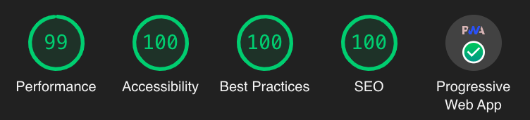

<!--
README about the GitHub repository template. Once the template is used,
this README should be deleted and only ../README.md should be kept
-->

# Progressive Web Application template

This repository is meant to serve as a general template for how to set up repositories to create a progressive web application.

_Screenshot of [lighthouse](https://github.com/GoogleChrome/lighthouse#lighthouse-------) scores for this template:_

The application is deployed at https://jsenv.github.io/jsenv-template-pwa/.

# How to use

> If you want to create a regular web application without PWA compatibility, use this template and remove files specific to PWA as explained in [PWA compatibility](../docs/pwa_compat/readme.md#PWA-compatibility).

- [ ] Create a GitHub repository using this template: https://github.com/jsenv/jsenv-template-pwa/generate
- [ ] Update fields in [package.json](../package.json), especially `"name"`, `"description"`, and `"author"`
- [ ] Update [README.md](../README.md) and delete `.github/README.md`
- [ ] Review [LICENSE.txt](./LICENSE.txt) and `"license"` in [package.json](../package.json#L6)

# Features

Documentation of the features, how to use and or remove them.

- [Formatting](../docs/formatting/readme.md#formatting): Formatting with prettier
- [Linting](../docs/linting/readme.md#linting): Linting with ESLint
- [Url resolution](../docs/url_resolution/readme.md#url-resolution): How url are resolved, especially for js imports
- [Production mode](../docs/production_mode/readme.md#production-mode): Ability to write code specific to production or development
- [Development server](../docs/dev_server/readme.md#Development-server): A dev server with auto reload
- [Testing](../docs/testing/readme.md#testing): Run your tests with jsenv
- [Code coverage](../docs/code_coverage/readme.md#Code-coverage): Code coverage with codecov
- [Building](../docs/building/readme.md#Building): Optimize files for production
- [Pull request impacts](../docs/pr_impacts/readme.md#Pull-request-impacts): Automated process tracking pull requests impacts on lighthouse, performances and file sizes
- [PWA compatibility](../docs/pwa_compat/readme.md#PWA-compatibility): Offline + add to home screen compatibility
- [Deploying](../docs/deploying/readme.md#deploying): Auto deployment with github pages

# Things to know

- Node.js Long Term Support version should be used while coding. At the time of writing this documentation it means version 14.17.0.

- Default branch of the repository is named _main_. It can be renamed in repository settings on GitHub.

- There is 2 type of js files: js meant to be runned by node and js meant to be runned by a browser. To help recognize which are which, browser files use _.js_ extension while node files uses _.mjs_ extension. This pattern is subjective and you are free to change it.
