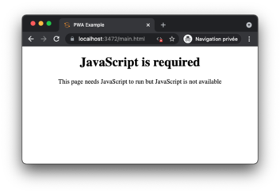
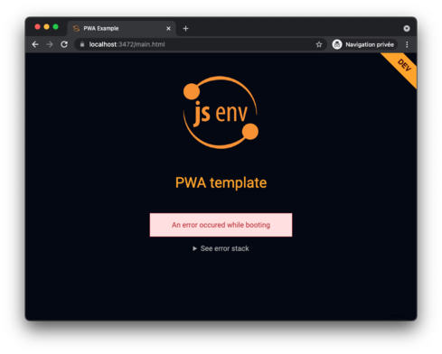
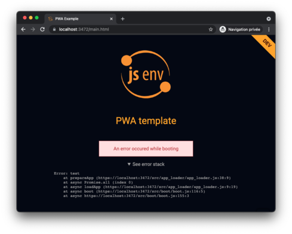
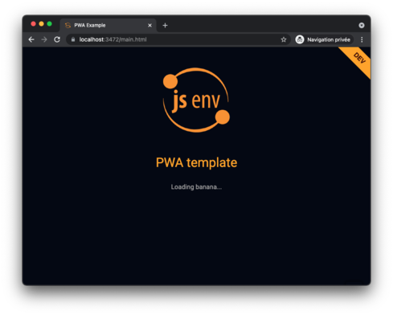
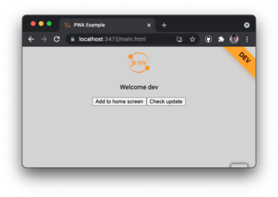
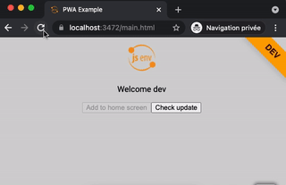

# Booting

The application boot progressively handling nicely the following:

- js is disabled
- browser is not supported
- network is slow
- unexpected error (network or runtime)
- mitigate font swapping
- progressive loading of CSS and JS

## Screenshots

| Scenario                       | Screenshot                             |
| ------------------------------ | -------------------------------------- |
| JavaScript disabled            |             |
| Browser not supported          |   |
| Booting start                  |           |
| Booting is slow                |         |
| Booting fetch error            |           |
| Booting runtime error          |           |
| Booting runtime error expanded |  |
| App loading start              |       |
| App loading progress           |    |
| App ready                      |               |
| Booting super fast             |      |

Some remarks:

- Fetch error happens if there is a 404 on app_loader.js for example
- Runtime error occurs when an error is thrown during app_loader.js execution
- As you can see on last scenario, splashscreen is not displayed if app is very fast to boot and load. It can happen on very fast network or when everything is in browser cache.

## Booting explanation

There is comments in [main.html](../../src/main.html) highlighting how booting is designed.
