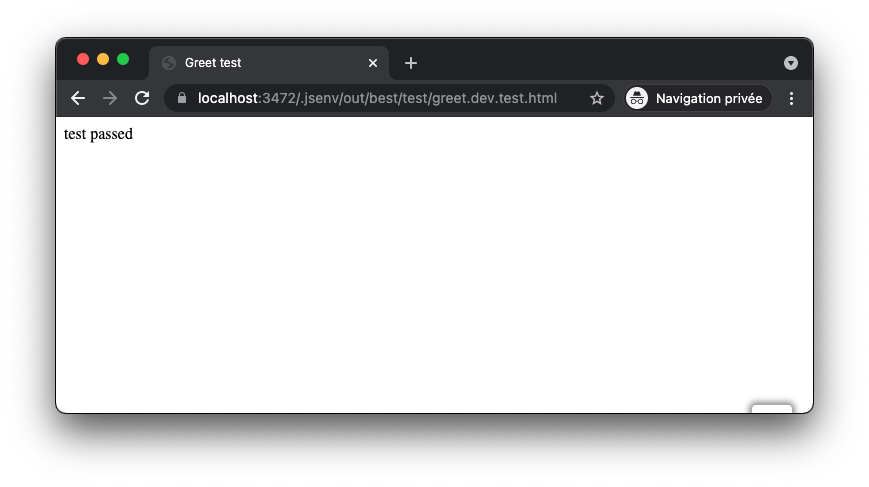

# Development server

You can start a local server to run the website on your machine.


The image above is a screenshot of the website runned using the development server in Chrome. The development server can be used to execute and debug the website. Browser will livereload when you change a file.

One last thing: it can be used to debug and execute **any html file in your project**.

_For example, [test/greet.dev.test.html](../../test/greet.dev.test.html):_



If you want to keep the development server, check [How to use development server](#how-to-use-development-server). Otherwise see [How to remove development server](#how-to-remove-development-server).

# How to use development server

```console
> npm start
server started at https://localhost:3472 (https://192.168.1.15:3472)
```

See [script/start/start.mjs](../../script/start/start.mjs)

# How to remove development server

1. Remove `"start"` from `"scripts"` in [package.json](../../package.json#L26)
2. Delete [script/start/start.mjs](../../script/start/start.mjs)
