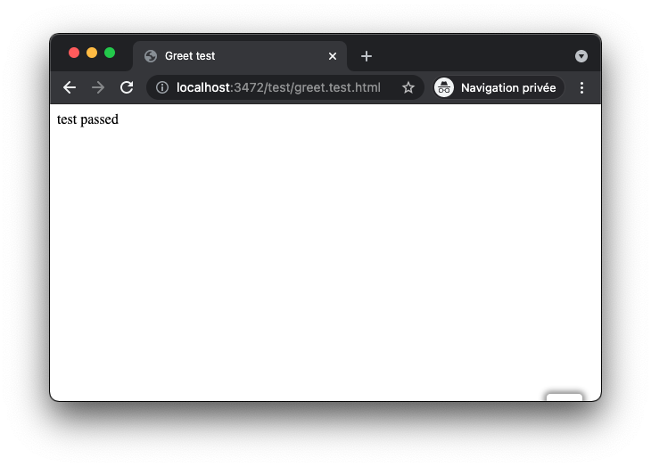

# Development server

You can start a local server to run the website on your machine.
If browser support is sufficient, source files are served without build step, otherwise they are transformed to be compatible with the browser.


The image above is a screenshot of the website runned in Chrome after starting the development server. Browser livereloads when you change a file.

One last thing: it can be used to debug and execute **any html file in your project**.

_For example, [test/greet.test.html](../../tests/greet.test.html):_



If you want to keep the development server, check [How to use development server](#how-to-use-development-server). Otherwise see [How to remove development server](#how-to-remove-development-server).

# How to use development server

```console
> npm run dev

✔ start server (done in 0.01 second)

- https://localhost:3472
```

See [scripts/server/start_dev_server.mjs](../../scripts/dev/start_dev_server.mjs)

# How to remove development server

1. Remove `"dev"` from `"scripts"` in [package.json](../../package.json#L26)
2. Delete [scripts/dev/start_dev_server.mjs](../../scripts/dev/start_dev_server.mjs)
