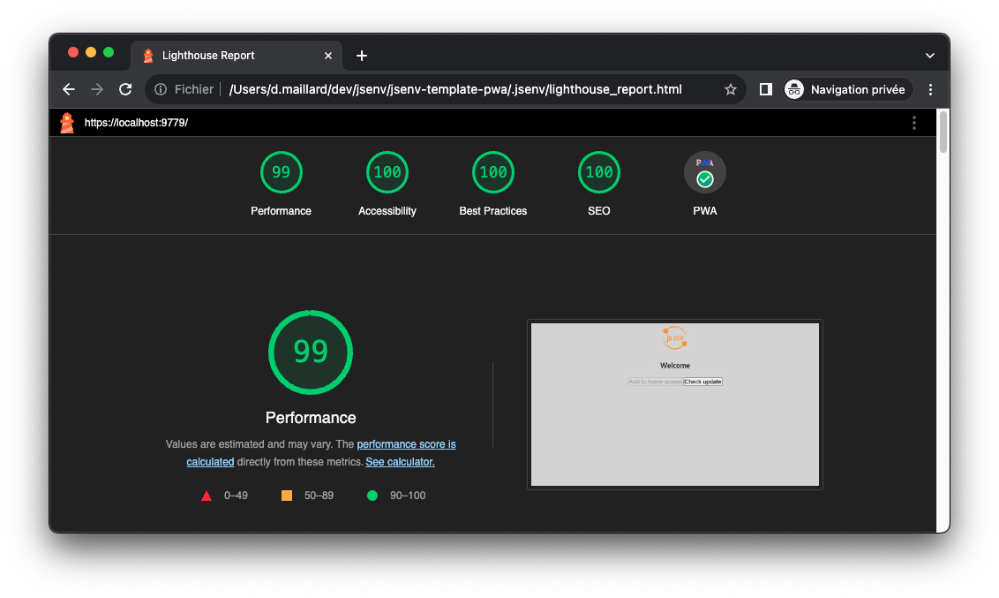

## Lighthouse impact


# How to use ligthouse impact?

A js file exports [lighthouseReport](../../scripts/lighthouse.mjs). This file starts a headless chrome and measure lighthouse score.

This file can also be runned locally as shown below.

```console
> node ./scripts/lighthouse.mjs

-> file:///Users/dmail/jsenv-template-pwa/scripts/lighthouse_report.json
-> file:///Users/dmail/jsenv-template-pwa/scripts/lighthouse_report.html
{
  "performance": 0.99,
  "accessibility": 0.76,
  "best-practices": 0.93,
  "seo": 0.85,
  "pwa": 0.6
}
```

lighthouse_report.html can be opened in a browser as shown in screenshot below.



# How to remove lighthouse impact?

1. Remove `"lighthouse"` from `"scripts"` in [package.json](../../package.json#L26)
2. Delete [.github/workflows/pr_impact/report_lighthouse_impact.mjs](../../.github/workflows/pr_impact/report_lighthouse_impact.mjs)
3. Delete [scripts/lighthouse.mjs](../../scripts/lighthouse.mjs)
4. Remove `"@jsenv/lighthouse-impact"` from `"devDependencies"` in [package.json](../../package.json#L48)
