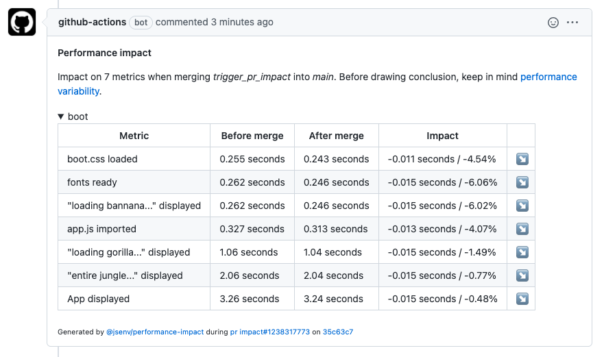

# Performance impact



# How to use performance impact?

A js file exports [generatePerformanceReport](../../../script/performance/generate_performance_report.mjs) function. _generatePerformanceReport_ measure 7 metrics and is used to analyse impact on performances.

This function can also be runned locally as shown below.

```console
> npm run measure-performances

{
  "boot.css loaded": "0.699 seconds",
  "fonts ready": "0.743 seconds",
  "\"loading bannana...\" displayed": "0.743 seconds",
  "app.js imported": "0.823 seconds",
  "\"loading gorilla...\" displayed": "1.55 seconds",
  "\"entire jungle...\" displayed": "2.55 seconds",
  "App displayed": "3.75 seconds"
}
```

# How to remove performance impact?

1. Remove `"measure-performances"` from `"scripts"` in [package.json](../../package.json#L24)
2. Delete [.github/workflows/performance_impact.yml](../../.github/workflows/performance_impact.yml)
3. Delete [.github/workflows/pr_impact/report_performance_impact.mjs](../../.github/workflows/pr_impact/report_performance_impact.mjs)
4. Delete [scripts/performance/](../../scripts/performance/) directory
5. Remove `"@jsenv/performance-impact"` from `"devDependencies"` in [package.json](../../package.json#L48)
