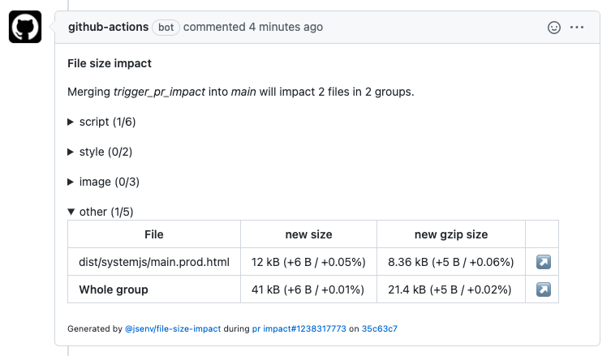
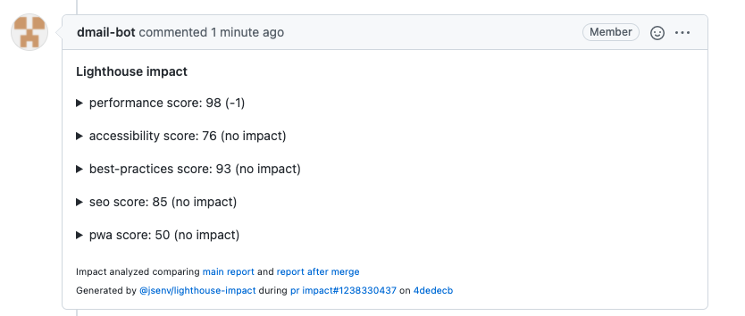

# Pull request impacts

There is a GitHub workflow runned against every pull request to report their impact various metrics.
Each report is posted in a comment of the pull request.
Every time the pull request changes, workflow reruns and the comment is updated.

## File size impact

_Screenshot of a file size impact comment:_

Read more in [file_size_impact.md](./file_size_impact.md)

## Lighthouse impact

_Screenshot of a lighthouse impact comment:_

Read more in [lighthouse_impact.md](./lighthouse_impact.md)

## Performance impact

_Screenshot of a performance impact comment:_

Read more in [performance_impact.md](./performance_impact.md)
