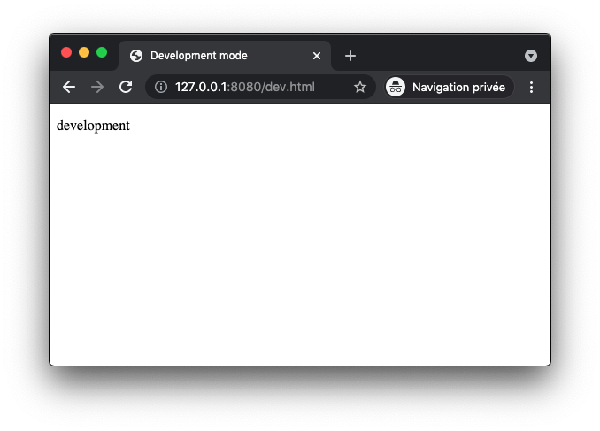
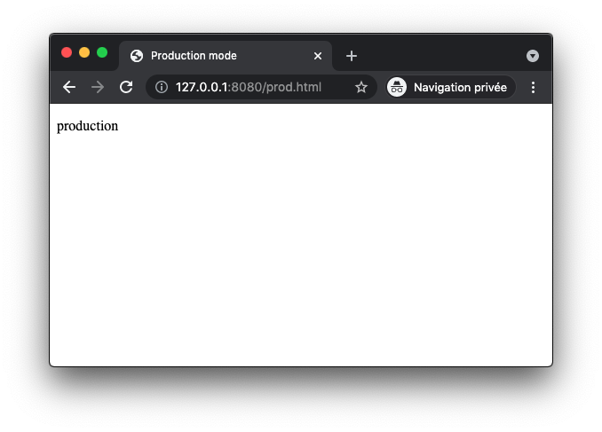
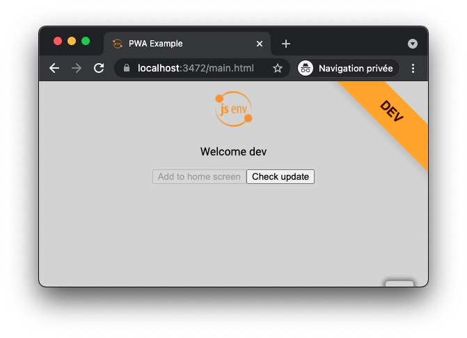
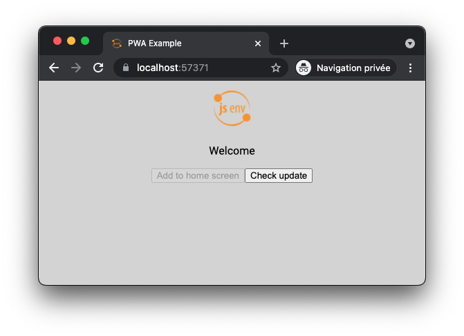

# Production mode

The goal of the production mode is to have a second way to execute your code. With it you have 2 ways of executing your code:

1. _development mode_
2. _production mode_

In _development mode_ you can do things specific to development and in _production mode_ do things specific to production.

`import.meta.dev` can be used for this purpose. Let's take an example with some js.

```js
const message = import.meta.dev ? "development" : "production"
document.querySelector("#message").innerHTML = message
```

Depending how the code is runned, browser displays either _development_ or _production_.

| `npm run dev`                   | `npm run build:serve`            |
| ------------------------------- | -------------------------------- |
|  |  |

This repository has preconfigured a _production mode_, if you want to keep this ability, check [How to use production mode](#how-to-use-production-mode). Otherwise see [How to remove production mode](#how-to-remove-production-mode).

# How to use production mode

In development mode there is an orange ribbon. After the build code specific to development is removed by treeshaking.

| npm run dev             | npm run build:serve      |
| ----------------------- | ------------------------ |
|  |  |

# How to remove production mode

1. Remove all `import.meta.dev` occurences
