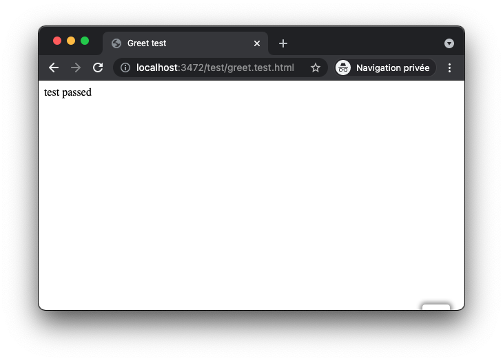
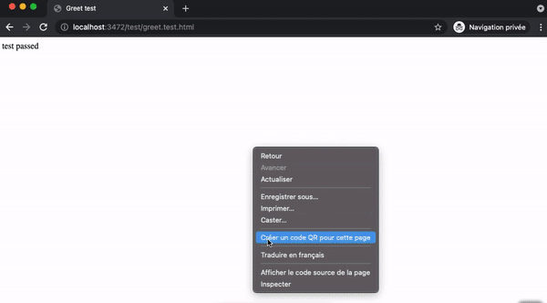

<!-- https://github.com/github/docs/blob/main/tests/README.md -->

# Testing

All test files are inside the [test/](./test/) directory and ends with `.test.html`.

If one or more test is failing, the main GitHub **workflow will fail** during [check tests](../../.github/workflows/main.yml#L44) step.

Code coverage from test files is monitored, this is documented in [docs/code_coverage/code_coverage.md](../code_coverage/code_coverage.md#code-coverage).

If you want to keep test files check [How to use tests](#How-to-use-tests). Otherwise see [How to remove tests](#How-to-remove-tests).

# How to use tests

Test files are written using jsenv philosophy:

**A test file is a regular html file**.



See [test/greet.test.html](../../test/greet.test.html)

## Debug a test

As previously mentioned, according to jsenv philosophy a test file executes like a classic file. It means you can use the debugging tool of classic files to debug test files.

The recommended way to debug a file is to start the development server and use Chrome devtools.



## Executing all tests

Use `npm test` command. It is configured to execute [scripts/test/test.mjs](../../scripts/test/test.mjs) which is responsible to find and execute all your test files.

Test files are executed twice, a first time on Chrome, a second time on Firefox.

```console
> node ./scripts/test/test.mjs

✔ execution 1 of 2 completed (all completed)
file: test/greet.test.html
runtime: chromium/97.0.4666.0
duration: 1.6 seconds

✔ execution 2 of 2 completed (all completed)
file: test/greet.test.html
runtime: firefox/93.0
duration: 1.6 seconds

-------------- summary -----------------
2 executions: all completed
total duration: 3.7 seconds
----------------------------------------
```

# How to remove tests

If you don't need test or want to use an other test framework/library follow the steps below.

1. Remove `Run tests` step in [.github/workflows/main.yml](../../.github/workflows/main.yml#L40)
2. Remove these `"scripts"` in [package.json](../../package.json#L26)

   - `"test"`
   - `"test:coverage"`
   - `"playwright-install"`

3. Delete [scripts/test/](../../scripts/test/) directory
4. Remove `"@jsenv/assert"` from `"devDependencies"` [package.json](../../package.json#L44)
